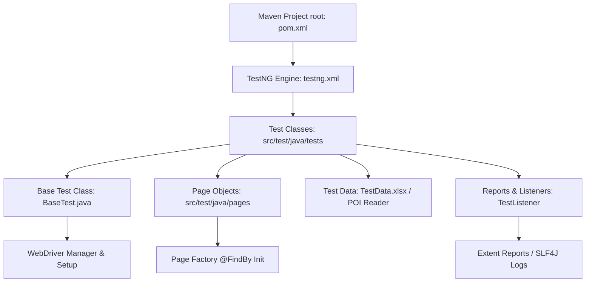

# Selenium UI Automation Suite

[](https://www.oracle.com/java/)
[](https://www.selenium.dev/)
[](https://testng.org/)
[](https://maven.apache.org/)
[](LICENSE)

A robust, enterprise-grade test automation framework built to automate UI validation workflows on [Automation Exercise](https://automationexercise.com/). This suite adopts industry-standard design patterns to ensure maximum scalability, clean abstraction, and comprehensive test reporting suitable for modern CI/CD integration.

---

## 🛠️ Tech Stack & Key Dependencies

* **Core Language:** Java (JDK 17)
* **Web Automation Tool:** Selenium WebDriver (v4.34.0)
* **Testing Engine:** TestNG (v7.11.0)
* **Build Tool:** Apache Maven
* **Data-Driven Source:** Apache POI (Excel integration)
* **Reporting Engine:** ExtentReports (v5.1.2)
* **Logging System:** SLF4J with Log4j2

---

## 🏗️ Framework Architecture

This framework employs the **Page Object Model (POM)** design pattern to separate test logic from page-specific element controls.



### Key Design Pillars:
1. **Separation of Concerns:** Element locators and page actions reside inside individual Page Object classes, protecting tests from UI layout changes.
2. **Explicit Wait Synchronization:** A dedicated `WaitHelper` class wraps Selenium's `WebDriverWait` to handle element visibility and clickability dynamically, minimizing flaky runs.
3. **Data-Driven Capabilities:** Test configurations and dynamic user account credentials are parsed directly from an Excel sheet (`TestData.xlsx`) using Apache POI, simulating real-world user registration.
4. **Thread-Safe Reporting:** Implements a `ThreadLocal`-based custom `TestListener` hooked into `ExtentReports` to maintain isolated test execution metrics and compile interactive HTML reports.

---

## 📂 Project Structure

```directory
.
├── src/
│   └── test/
│       ├── java/
│       │   ├── base/           # Browser setup and configuration (BaseTest.java)
│       │   ├── listeners/      # TestNG listeners for test reporting (TestListener.java)
│       │   ├── models/         # POJOs for mapping external files (UserData.java)
│       │   ├── pages/          # Page Objects encapsulating element actions
│       │   ├── tests/          # 26 End-to-End Test Classes
│       │   └── utility/        # Custom waits, assertion overrides, excel and reporting helpers
│       └── resources/
│           ├── TestData.xlsx   # Data source containing random user profiles
│           ├── log4j2.xml      # Console and file logging configuration
│           └── picture.jpeg    # Test upload mock asset
├── pom.xml                     # Maven project configuration file
├── testng.xml                  # Test suite runner defining execution order
└── README.md                   # Project documentation
```

---

## ⚙️ Configuration & Execution

### Prerequisites
1. **Java Development Kit (JDK 17 or higher)** installed and verified.
2. **Maven 3.9+** installed (locally configured at `C:\Program Files\apache-maven-3.9.16\bin` or added to system PATH).

### Running Tests
Execute the entire TestNG regression suite sequentially using the command below:

```bash
mvn clean test
```

To run a specific test class from the suite:

```bash
mvn test -Dtest=TC01_RegisterUserTest
```

---

## 📊 Reports & Logging

After execution completes:
* **ExtentReports Dashboard:** View the rich, interactive dashboard report generated at `test-output/ExtentReport.html`.
* **Execution Logs:** Standard framework activity and assertion details are written to target logs using the SLF4J engine.
